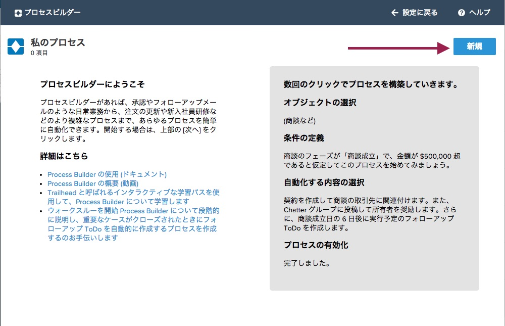
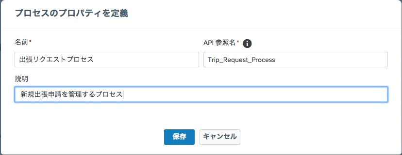

出張申請のプロセスをこの組織に作成していきます。このプロセスを実装するにあたりいくつかのビジネス要件があります。全ての$500以上の出張は特別なプロセスを経る必要があります。

## プロセスのゴール
- 出張申請を承認プロセスへ回す
- 出張の詳細は従業員出張コミュニティへ共有し、コラボレーションを推進する
- 出張者のカレンダーを自動的に更新する
- 従業員はモバイルから確認することができる

## 何を学ぶことができるか
- 新しいLightning プロセスの作成

##新しいプロセスを作成:

1. 設定画面の左側のナビゲーションメニューより、**ビルド | 作成 | ワークフローと承認申請 | プロセスビルダー**　へアクセスします。

2. **プロセスビルダー** をクリックすると、初回にはプロセスビルダー紹介のスプラッシュスクリーンが表示されます。 **新規** を選択して、プロセスの作成を開始します。  
  

3. 名前: **出張リクエストプロセス**
4. API 参照名 : Trip_Request_Process
5. 説明: **新規出張申請を管理するプロセス**

6. **保存** をクリックします
  

これで新しいLightningプロセスの作成が完了しました。次のステップで、いつ・どのタイミングでこのプロセスを動作させるかを定義する必要があります。

<a href="setup-environment.html" class="btn btn-default"><i class="glyphicon glyphicon-chevron-left"></i> 戻る</a>
<a href="create-lightning-application.html" class="btn btn-default pull-right">次へ <i class="glyphicon glyphicon-chevron-right"></i></a>

