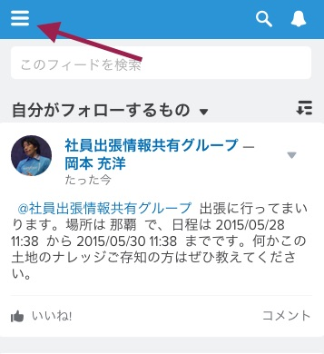

このモジュールでは, モバイル環境で有効なプロセスをテストします。Salesforceの本番及びテスト環境で開発したモバイルアプリケーションがエンドユーザの実際のモバイル画面でどのようなユーザ体験を提供するかを確認するのは重要です。コンピュータ上のChrome デスクトップブラウザのモバイルビューもしくは、スマートフォン上のSalesforce1モバイル・アプリのどちらでも利用できますが、ここでは Chromeのモバイルビューを使った方法を紹介します。

もしChromeを使えない環境であったり、スマートフォンやモバイルデバイスからからSalesforce1モバイル・アプリへアクセスできない場合には、レビューはデスクトップ用の画面からでも、Chatterタブの**新規出張** アクションで実施することが可能です。

## 何を学ぶことができるか
- Salesforceの開発において、ChromeブラウザやSalesforce1アプリを利用してどのようにモバイルのテストを行うか。

## ステップ 1: Chromeモバイルビューへ変更する

1. もしSalesforce環境にログインしていなければ、Choromeブラウザでログインを行います。ブラウザのURLアドレスバーに入力を行います。

2. /one/one.app を現在のSalesforceインスタンスのURLドメインの後ろに追加します。例えばDeveloper Editionがna15にある場合、ログインした際のURLは https://na15.salesforce.com/home/home.jsp　のようになっています。 Salesforce1モバイルアプリの画面を表示するには /home/home.jsp を /one/one.app に変更します。
	
このようにSalesforceのモバイル用の画面を見ることができます。
	

3. ブラウザウィンドをリサイズして、モバイルのスクリーンに近いサイズに変更します。
	

## ステップ 2: 新しい出張申請を作成する
環境をセットアップした際に、グローバルレイアウトに出張申請用の新しいカスタムアクションを追加しました。 これは全てのモバイルユーザが、それぞれのモバイルスクリーンからアクセス可能となっています。新しい出張申請をアクションを通じて行い、作成したLightningプロセスをテストします。

1. モバイル画面の下部に、アイコンが並んでいるアクションバーがあります。ヘリコプターアイコンの設定されている **新規出張** アクションを選択します。

	

2. 新しい出張レコードを作成します。出張名を **沖縄出張** とし、, 日程を本日から数日後に設定し (これは後ほど行動の更新アクションを確認しやすくなります)、 想定される総経費を 100000 とし、場所を那覇とします。
	

3. **保存**を選択します。

## ステップ 3: プロセスの結果を確認する
承認リクエストレコードが作成されたので、モバイル環境から結果を確認してみましょう。

1. ユーザのChatterフィードへのプロセスからの投稿を確認します
	

2. モバイル画面の左側ナビゲーションからカレンダーの更新アクションを確認します
	

3. **行動** をクリックし、カレンダーへ出張リクエストを作成した日付にレコードが作成されていることを確認します。
	

4. モバイル画面の左側ナビゲーションの承認リクエスト上にある承認ステータスを確認します。**表示件数** をクリックし、**出張リクエスト**を選択します。

5. 先ほど作成したサンディエゴのレコードをクリックし、レコードの **関連** タブをタップします。そして  **承認履歴** を確認しこのレコードの現在の承認ステータスを確認します。

おめでとうございます! たった数分でSalesforceに一行もコードを書くことなく、複数のアクションを持ち、かつモバイルユーザ向けにテスト済みの Lightning プロセスを作成することができました。

<a href="create-searchbar-component.html" class="btn btn-default"><i class="glyphicon glyphicon-chevron-left"></i> 戻る</a>
<a href="next.html" class="btn btn-default pull-right">次へ <i class="glyphicon glyphicon-chevron-right"></i></a>

