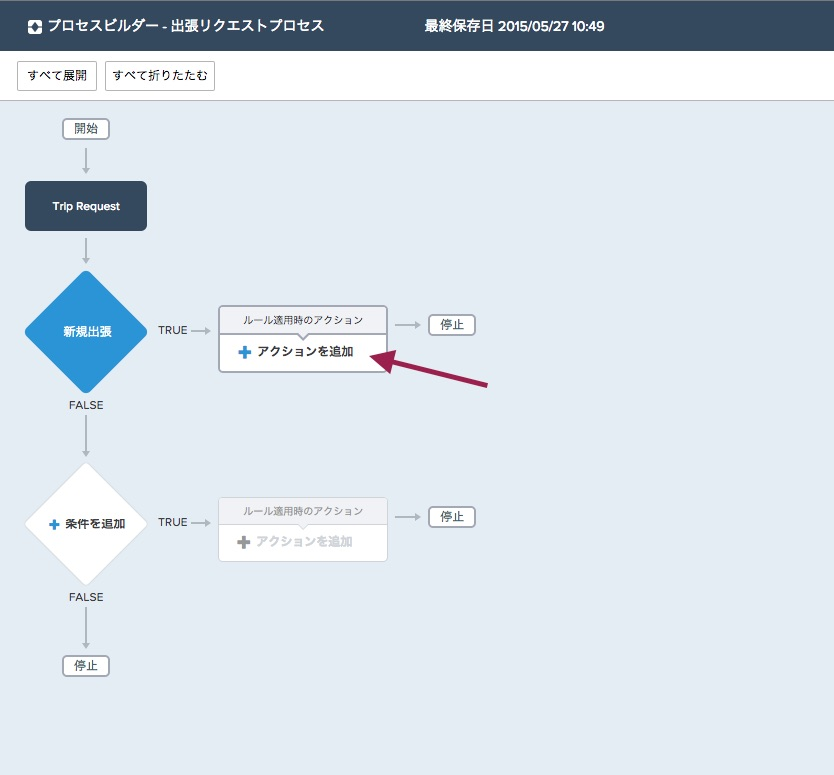
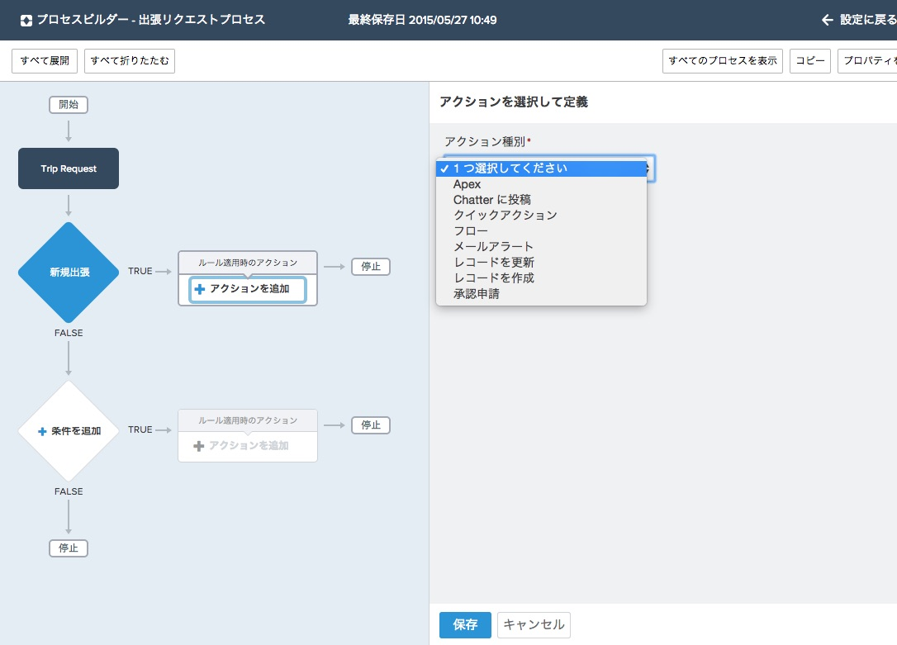
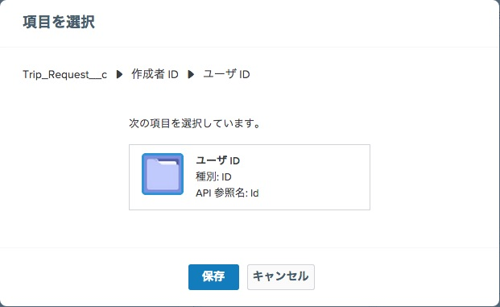
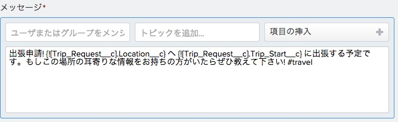
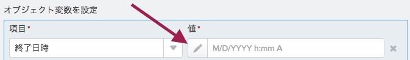
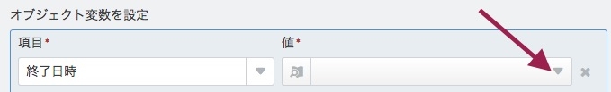
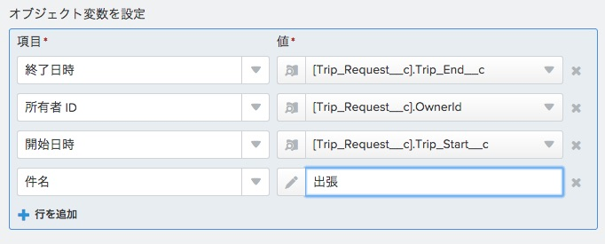
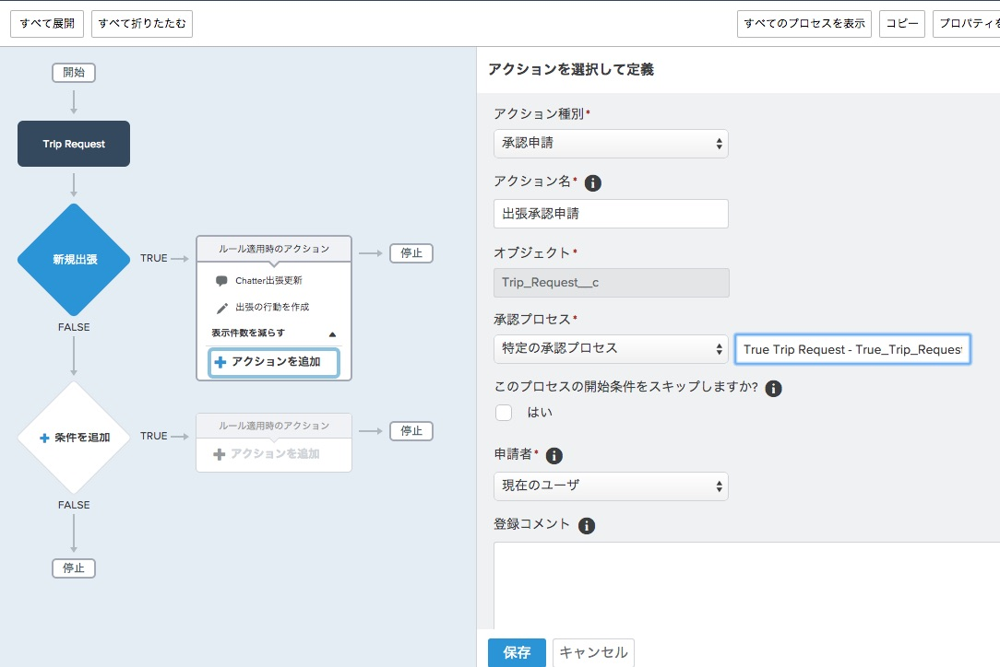

このモジュールでは、プロセスへアクションを追加します。Lightning プロセスビルダーを使えば、即時、もしくはスケジュールされたアクションを、前のモジュールで定義した条件の評価に合致した際に実行できます。 このチュートリアルでは、即時実行のアクションを作成します。ここでは3つの Chatterに投稿、レコードを作成、, 承認申請のアクションを作成していきます。Lightning プロセスビルダーを使わない場合は、新規レコードの作成や関連しないレコードへのアクセスには、コーディングを必要とします。


## 何を学ぶことができるか
- プロセスビルダーで即時実行アクションを追加する方法


## ステップ 1: Chatterに投稿アクションを追加
１つのビジネス要件には、他の従業員などに対して、出張を通知することがあります。Chatterに投稿アクションを使って出張者のChatterタイムラインに対して、出張の詳細にトピックやハッシュタグを加えて、通知を出すようにします。

1. 作成した条件のすぐ右側にあるルール適用時のアクションエレメントで、**アクションを追加**　を選択します。

 

2. アクション種別には**Chatterに投稿**を選択します。
*ここでは様々なタイプのアクションを作成できます*


3. アクション名には **Chatter出張更新**を入力します
1. Chatterポストを出張者のフィードに投稿したいので、ここでは投稿先には: **ユーザ** を選択し、レコードからユーザを選択 ,  作成者のユーザIDを選択します。

4. これでどこにChatterの更新が投稿されるかが定義できましたので、テキスト情報を投稿に定義します。メッセージボックスの **項目の挿入** エリアには、場所や日程など、レコードデータから入力できるフィールドが用意されています。
text
```
出張申請! {![Trip_Request__c].Location__c} へ {![Trip_Request__c].Trip_Start__c} に出張する予定です。
もしこの場所の耳寄りな情報をお持ちの方がいたらぜひ教えて下さい! #travel
```




1. **保存** をクリックします。


## ステップ 2: レコードを作成アクションの追加
その他のビジネス要件として、出張者のカレンダーを自動的に更新することがあります。このカレンダーは標準オブジェクトである行動を利用して作られているので、出張申請レコードに入力された日程を利用して新しい行動レコードを作成したいと思います。Lightningプロセスビルダーでは、ターゲットオブジェクトに関連するしないに関わらず、全くの新規のレコードの作成を標準及びカスタムオブジェクトに対して行うことが可能です。
関連するとは取引先項目が取引先責任者にあるように、参照関係や主従関係がオブジェクトにある状態の事をさします。これをSalesforceではこれらのオブジェクトは関連していると定義しています。このステップでは**行動**レコードを作成しようとしていますが、出張申請オブジェクトとは関連を持っていません。
しかし新しいレコードを作成するだけでなく、出張申請レコードから基準となる項目を利用することも可能です。

1. 前回アクションを追加したのと同じルール適用時のアクションノードで **アクションの追加** を選択します
2. **レコードを作成** を選択します
3. アクション名に "出張の行動を作成"と入力します
3. 全ての標準及びカスタムオブジェクトが選択リスト内で有効となっています。 **行動** オブジェクトを選択します。
4. 新しいレコードの項目と出張申請レコードからの情報を入力する行が並んでおり、プロセスビルダーのルックアップ機能を使うことができます。値列の左側の **編集** アイコンをクリックしてルックアップ機能と切り替えることができます。

1.その時、右側の矢印を選択することによって、ルックアップ画面が開きます。

1. 新しい行動レコードの値を、下記に基づいて入力します。件名項目にはルックアップは使用せずに、代わりに"出張" を設定すると、全てのレコードはこの件名で作成されます。

1. **保存** をクリックします。


## ステップ 3: 承認申請アクションを追加
最後でそして最も重要なビジネス要件はこの出張申請で承認プロセスを実行することです。Lighting プロセスビルダーを使えば、既存の承認プロセスをトリガすることも、システムの承認者フィールドに依存した標準承認プロセスを選択することも可能です。この演習では先ほど作成した既存の承認プロセスを選択します。

1. **アクションを追加**をクリックします。
2. アクション種別 **承認申請**
3. アクション名 **出張承認申請**
4. **特定の承認プロセス** を選択し、**出張承認ルール**で先ほど作成した承認プロセスルールを入力します

5. **保存**　をクリックします。


<div class="row" style="margin-top:40px;">
<div class="col-sm-12">
<a href="create-lightning-application.html" class="btn btn-default"><i class="glyphicon glyphicon-chevron-left"></i> 戻る</a>
<a href="create-searchbar-component.html" class="btn btn-default pull-right">次へ <i class="glyphicon glyphicon-chevron-right"></i></a>
</div>
</div>
