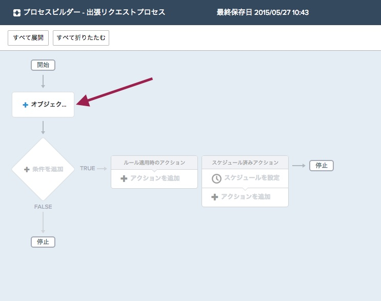
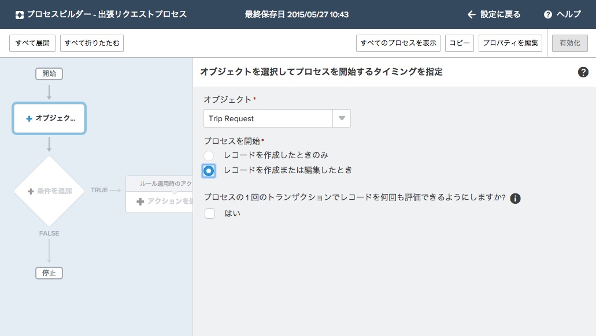
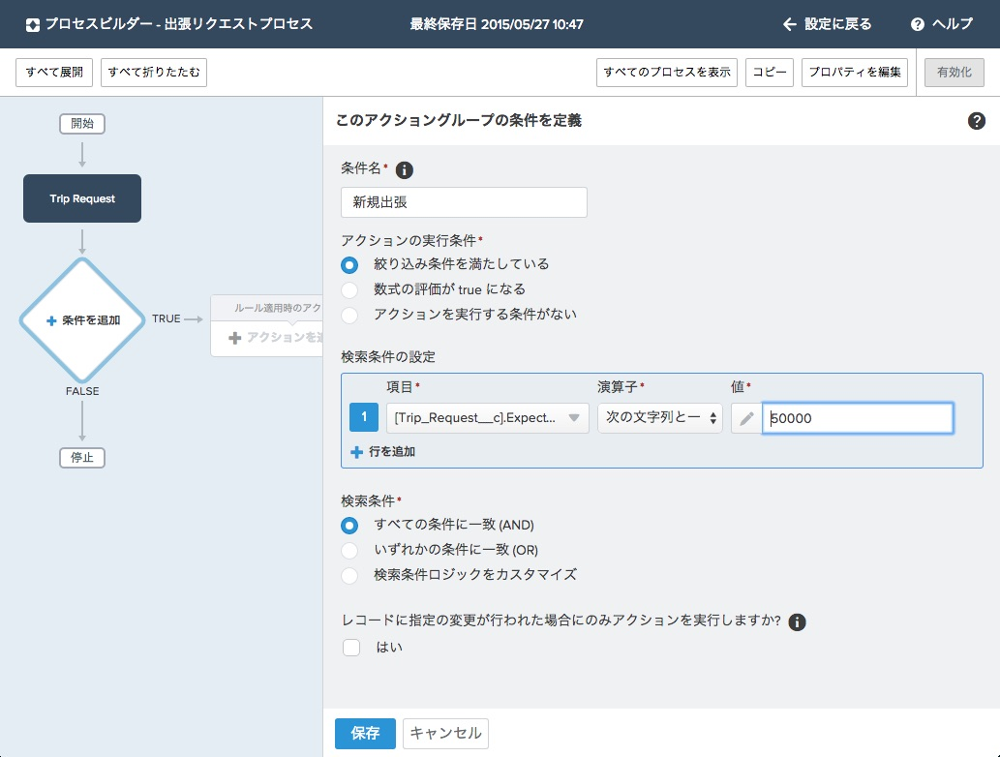

承認プロセスは出来上がりましたが、このままではいつプロセスが動作すればよいかという条件がありません。いつ条件を評価して、どのアクションをプロセスが実行すればよいでしょうか。または条件に合致しない場合、プロセスはアクションをスキップし、次の実行条件を評価しなければなりません。Remember that the process executes only one action group.
ターゲットとなるオブジェクトをプロセスに追加します。このオブジェクトはプロセスの条件が評価される場所となります。この例ではインストールしたカスタムオブジェクトである**出張申請**を評価します。新しいLightning プロセスビルダーでは、元となるオブジェクトと関連する・しないに関わらず、オブジェクトに対してアクションを実行することが可能です。アクションはオブジェクトが作成もしくは更新されたタイミングで実行可能ですが、このステップではまずどのオブジェクトにどういった条件でアクションを動作するかを定義します。

## 何を学ぶことができるか
- プロセスの対象オブジェクトを定義する
- いつ対象オブジェクトを評価すべきかを定義する
- プロセスの条件を定義する

## ステップ 1: オブジェクトの定義

1. プロセス画面において　**オブジェクトを追加** をクリックします。.
  

2. AppExchangeパッケージからインストールされたものも含め、全ての標準及びカスタムオブジェクトが選択可能です。ここでは**出張申請** オブジェクトを選択します。
3. 全ての出張リクエストが適合するかどうかをテストしたいので、作成されるか編集されるかが行われた場合に条件をテストします:
    - プロセスを開始: **レコードを作成または編集したとき**
*もしあなたがワークフロールールに詳しい場合、3つめのプション(“作成されたとき、およびその後基準を満たすように編集されたとき”)はどうなったのか気になる所かもしれませんが, これは心配いりません。もし“レコードを作成または編集したとき*を選択した際に条件ノードで同様の設定を行う事が可能です。
4. チェックボックスには **チェックを入れない**
  *注意: こちらを選択した場合, プロセスは同様のレコードを同一のトランザクション内で5 回まで評価します。プロセス、ワークフロールール、フローなどの更新によって、レコードが同一トランザクション上で更新されることで再評価される可能性があるからです。
  例えば、営業レビュープロセスには複数のステップがあり、承認、通知、およびフィールドの更新があるとします。これらの変更がプロセスの中や組織内の他のワークフロールールやフローで行われると可能性があります。プロセスビルダーに単一トランザクションでのレコードの再評価を許可すると、他のプロセスによる変更も含めた全ての変更を管理し評価することができます。*

5. **保存** を選択します。
  

## ステップ 2: 条件の定義
これで*どこで*プロセスが評価されるかを定義できましたが、*いつ* プロセスが実行されるかを定義する必要があります。True / False ベースの複数条件指定によって複数のアクションを作成できます。
このチュートリアルでは１つの条件で即時アクションを実行しますが、Lightningプロセスビルダーでは複数の異なる条件を定義しつつ、即時実行とスケジュール実行のアクションを定義することも可能です。

1. プロセスビルダー画面の中の **条件を追加** ノードをクリックします
2. 条件の詳細を定義します
     - 条件名: **新規出張**
*この名前は、プロセス内の他の条件及びアクショングループから識別するためにキャンバスに表示されます*
     - アクションの実行条件: **絞り込み条件を満たしている**
     *条件式は既存のフィルタや数式もしくは条件なしにプロセスアクションを実行することが可能です*
     - 検索条件の設定: `Trip_Request__c.Expected_Total_Cost__c` >= 50000
     - 検索条件: **すべての条件に一致 (AND)**
     - **レコードに指定の変更が行われた場合にのみアクションを実行しますか?** の **はい** のチェックボックスを**オン**にします。 *チェックボックスをオンにすると、アクションが所定の変更が行われた時のみ動作します。これはアクションが以前条件に適合しない状態で保存されており、その後条件に適合した瞬間にのみ動作するが、それ以外や関係の無い変更が行われた場合には、アクションは実行されないことを意味します。*
3. **保存** をクリックします
  

これでいつ及びどこでこのプロセスが動作すべきかを定義できました。これでどんな処理を実行すべきかを定義することができるようになりました。

<a href="create-apex-controller.html" class="btn btn-default"><i class="glyphicon glyphicon-chevron-left"></i> 戻る</a>
<a href="create-contactlist-component.html" class="btn btn-default pull-right">次へ <i class="glyphicon glyphicon-chevron-right"></i></a>

