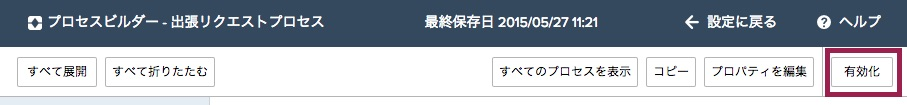
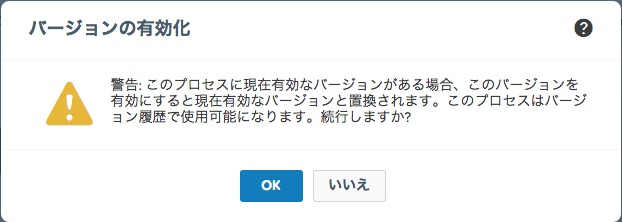

プロセスを作成し、条件を設定し、更に実行されるアクションも定義しましたが、この出張申請プロセスが実行されるには有効化を行う必要があります。
プロセスの有効化が行われると、プロセスを編集を行うことができなくなります。ですが、プロセスを新しい無効状態のプロセスとしてコピーして保存することは可能ですう。
プロセスは最低でも以下を持っていないと有効化できません:

1. 最低１つ以上の条件ノードの定義
2. 最低１つ以上のルール適用時もしくはスケジュール済みアクションの定義

##プロセスの有効化

1. プロセスビルダー画面の右上隅にある **有効化** をクリックします。

2. プロセス有効化に関する注意点を確認し、**OK** をクリックします。
*もし既に有効化されたバージョンのプロセスがあるならば、過去の有効バージョンは自動的に無効化されます。あとでそのバージョンを確認するには、プロセスのバージョン履歴を参照して下さい*

もし後でSalesforce上でのレコード評価やデータ作成及び編集など、プロセスが動作するのを止めたい場合には、有効プロセスを開き、無効化をクリックします。

これでプロセスは有効化されました！テストを行いましょう。

<a href="create-contactlist-component.html" class="btn btn-default"><i class="glyphicon glyphicon-chevron-left"></i> Previous</a>
<a href="create-contactdetails-component.html" class="btn btn-default pull-right">Next <i class="glyphicon glyphicon-chevron-right"></i></a>

