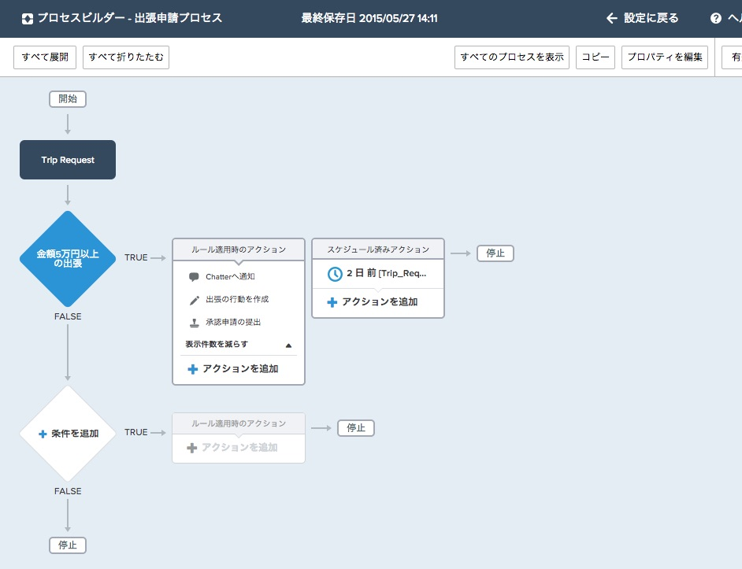

Salesforce1 Lightning プロセスビルダーは、会社の誰もが素早く簡単に、例えば従業員の追加や顧客の対応などのビジネス・プロセスを、1行もコードを書くことなく自動化することができる新しいワークフローツールです。  新しいビジネスプロセスはポイント & クリックの直感的なインタフェースで作成でき、退屈で時間のかかる手順を踏まずに、より素早く物事お行える様になっています。

Spring '15 リリースではLightning プロセスビルダーは**Enterprise, Performance, Unlimited 及び Developer Edition** のSalesforce環境で正式リリースとなりました。

このチュートリアルでは、Lightning プロセスビルダーを使って出張承認のビジネス・プロセスを作成します。プロセスは出張リクエストからのトリガにより自動的に複数の通知及びカレンダーの更新を行います。
プロセスは一行もコードを書くことなく、関連するアクション及びインストール済みのカスタムオブジェクトを利用しています。

## 何を学ぶことができるか

- プライベートAppExchangeパッケージのインストール
- Lightningプロセスの作成
- Chatterポストの自動化
- プロセスビルダーによる関連しないレコードの作成及び更新
- Lightningプロセスの有効化
- Lightningプロセスのモバイル環境でのテスト

## ブラウザ要件

以下のブラウザがSalesforceの動作でサポートされています:

- 最新バージョンのGoogle Chrome
- 最新バージョンのMozilla Firefox
- 最新バージョンのSafari
- Internet Explorer 11 以降
- それ以外のブラウザのサポートに関しては <a href="https://help.salesforce.com/apex/HTViewHelpDoc?id=getstart_browser_overview.htm" target="_blank">こちら</a> をご覧ください

## 問題をみつけたら？

-実際に動作をさせる過程で問題が発生した場合にはぜひIssue <a href="https://github.com/salesforcedevelopersjapan/lightning-process-builder-tutorial/issues" target="_blank">here</a>を作成してこのチュートリアルの品質改善にご協力下さい。
- または下にあるコメントセクションにて、質問や問題の報告を行うことも可能です。

<a href="create-developer-edition.html" class="btn btn-default pull-right">次へ <i class="glyphicon glyphicon-chevron-right"></i></a>

