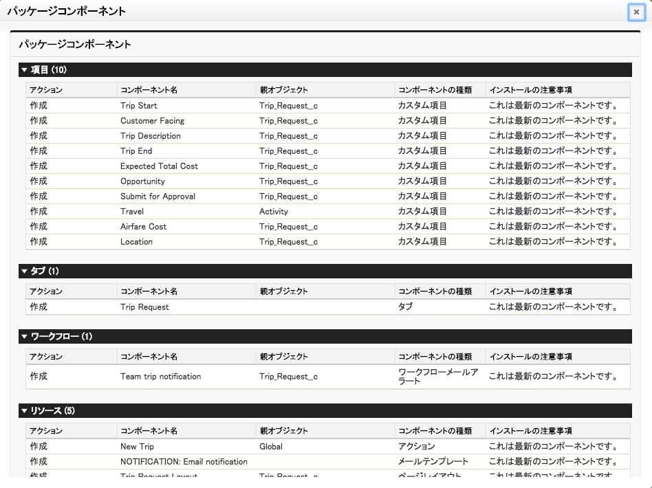
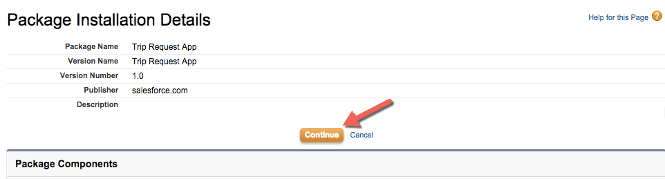
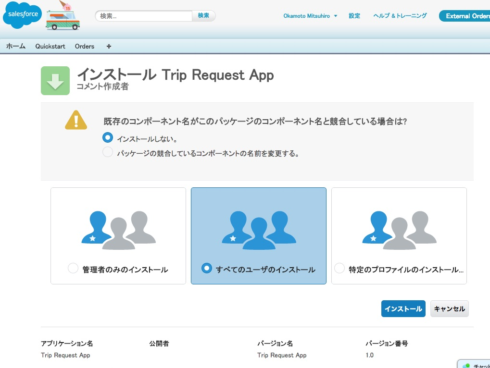
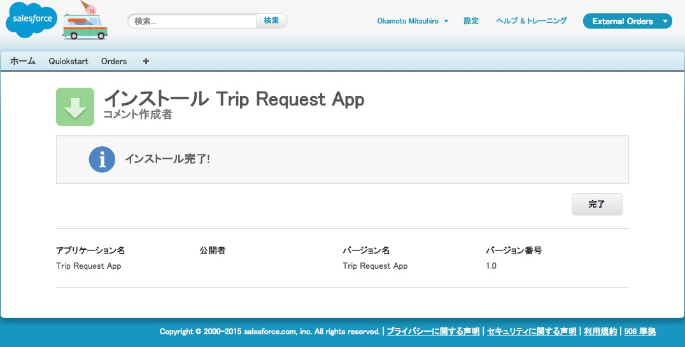
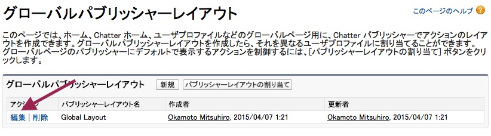
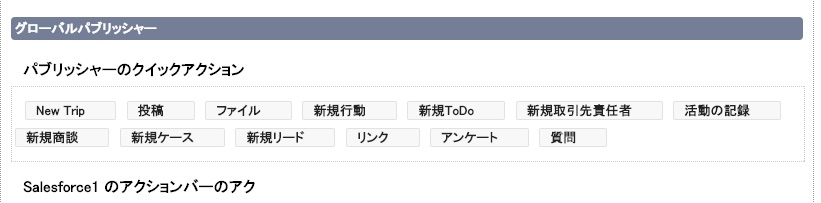
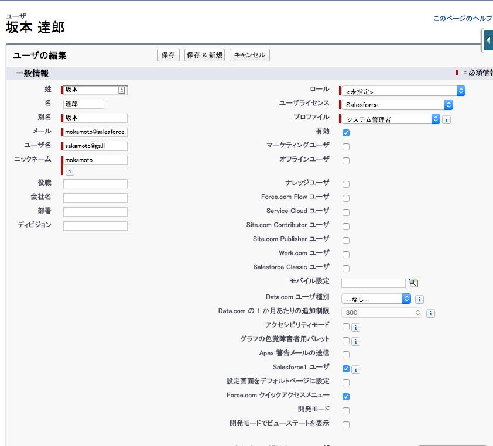
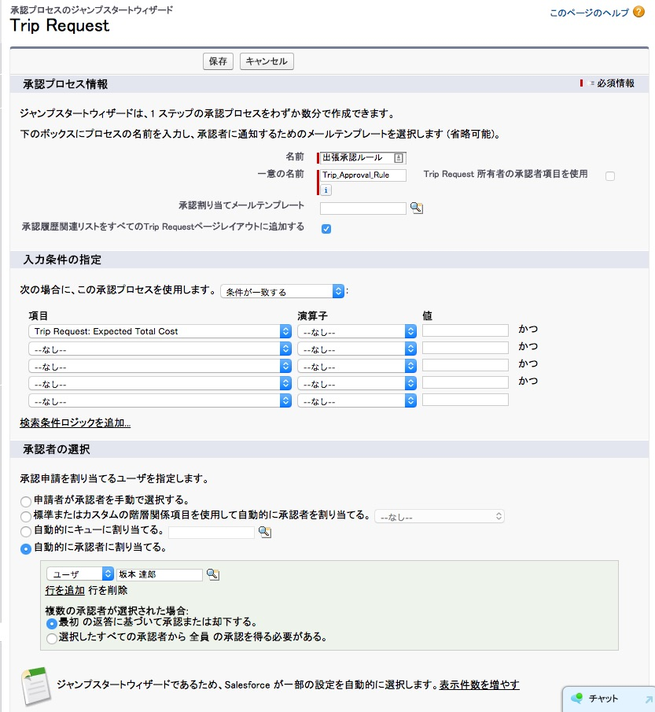

ビジネスプロセスを作成するために出張申請オブジェクトを含む標準パッケージをインストールします。

## 何を学ぶことができるか
- AppExchange パッケージのインストール
- パッケージコンポーネントのレビュー
- パッケージアクセスの定義
- グローバルアクションレイアウトの編集

## ステップ 1: AppExchange パッケージのインストール

<a href="https://appexchange.salesforce.com/" target="_blank">AppExchange</a> は世界初のオンデマンドのアプリケーション共有サービスです。AppExchange上で提供されているSalesforceアプリケーションの閲覧、テスト実行、共有そしてインストールが可能となっています。

パートナー及び開発者だけでなく、全てのユーザがアプリケーションをAppExahngeディレクトリへ掲載することができます。このディレクトリはSalesforceユーザが欲しいアプリケーションをを容易に探しだすことができ、顧客管理(CRM）の枠を超えてアプリケーションを拡張することが可能となっています。またアプリケーションはプライベート掲載も可能となっており、プライベート掲載の場合にはSalesforceによるセキュリティレビューが行われません。
  そのため、プライベート掲載のアプリケーションは信頼できるパートナーからのみインストールすることを推奨しています。
Salesforceへのパッケージのインストールに関するより詳細な情報は<a href="https://help.salesforce.com/apex/HTViewHelpDoc?id=distribution_installing_packages.htm" target="_blank">こちら</a>をご覧ください。

*注意: Appexchangeからアプリケーションをインストールするためには、ユーザーは “AppExchangeパッケージのダウンロード”権限が必要となります。システム管理者はでふぉるとでこの権現が有効になっていますが、他のユーザがパッケージをインストールしたい場合には、組織の管理者に確認する必要があります。*

1. Salesforce Developer Editionへログインします

2. 次のURLをブラウザのアドレスバーにコピー & ペーストします **http://bit.ly/TripApprovalPackage**

3. スクリーンには、パッケージに含まれておりこれからインストールされる予定の全てのコンポーネントが表示されます。この情報は後からでも **設定 | インストール済みパッケージ** から、パッケージごとにいつでも確認することができます。
*検証ルールやレコードタイプ、カスタム設定などはパッケージコンポーネントリストへ掲載されない場合がありますが、他のアイテムがインストールされる際に付随して追加される可能性があります。パッケージコンポーネントになにもない場合でも。パッケージは軽微な変更を行う可能性があります。*

4.  **次へ** をクリックします

5. **パッケージ API アクセスの承認** 画面で　**次へ**　をクリックします

6. **すべてのユーザへのアクセス権の付与** を選択し、 **次へ** をクリックします

このチュートリアルでは、全てのユーザにフルのアクセス権限を付与します。実際の運用環境では通常パッケージのインストールの際には **セキュリティ設定の選択** を使用し、プロファイルごとのセキュリティオプションをコントロールすることを推奨します。

7. **インストール**　を選択します。

8. インストールが完了の画面が表示されます。

## ステップ 2: グローバルレイアウトの編集
ビジネスプロセスはユーザが出張申請を登録したタイミングで自動的に実行されます。モバイルユーザにもこのプロセスを簡単に利用できるようにするには、Salesforce1モバイル・アプリの有効なアクションに**新規出張**を追加する必要があります。

1. **設定 | 作成 | グローバルアクション | パブリッシャーレイアウト**
2. グローバルレイアウトの **編集** をクリックします。

3. **新規出張** アクションをレイアウトの **投稿** のすぐ後にドラッグします。

4. **保存** を選択します

## ステップ 3: ユーザの作成
承認プロセスを行うにあたり、承認者用のユーザが必要になります。

1. **設定 | ユーザの管理 | 新規ユーザ**
2. **Jennifer Manager** というユーザを新しく作成します。

3. **保存** を選択します

## ステップ 4: 承認プロセスの作成
Lightning プロセスビルダーでは通常のプロセスの実施か、既存のプロセスをトリガとしたアクションの一部としての動作か、どちらにも対応しています。多くのユーザは既存の承認プロセスが既にあるので、このチュートリアルでは、既存のプロセスとの統合方法を見ていきます。そのため、出張申請の承認プロセスを作成する必要があります。

1. ** 設定 | 作成 | ワークフローと承認申請 | 承認プロセス ** へアクセスします
1. "承認プロセスを管理するオブジェクト" で **出張申請** を選択します。
1. **承認プロセスの新規作成 | ジャンプスタートウィザードを使用** を選択します
1. 以下のように新しい承認プロセスを入力します。
- 名前: 出張承認ルール
- 一意の名前: Trip\_Approval\_Rule
- 承認履歴関連リストをすべての出張申請ページレイアウトに追加する: チェックする
- 想定総費用 <= 500
- 自動的に承認者に割り当てる、で **Jennifer Manager** を承認者に追加

1. **保存** を選択します。
1. **承認プロセス詳細ページを見る**　を選択します。
1. 承認プロセス画面で　**有効化**　をクリックします。
1. **Ok**　を選択します。

これで非管理パッケージを環境にインストールし、モバイルアクションレイアウトの編集が完了しました。この既存のパッケージを使って更にビジネスプロセスを自動化していきます。

<a href="create-developer-edition.html" class="btn btn-default"><i class="glyphicon glyphicon-chevron-left"></i> 戻る</a>
<a href="create-apex-controller.html" class="btn btn-default pull-right">次へ <i class="glyphicon glyphicon-chevron-right"></i></a>

